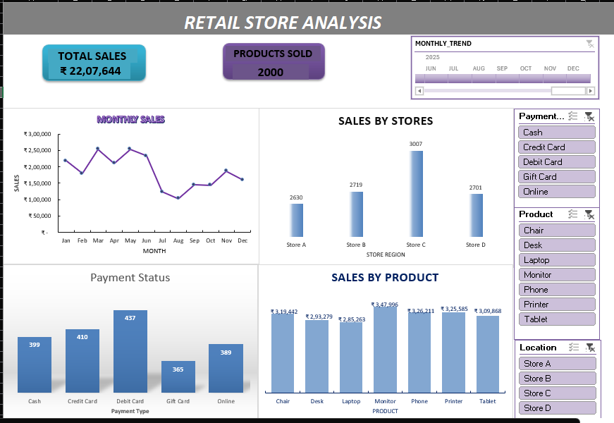

# Excel-data-analytics-projects
Collection of interactive Excel dashboards, data cleaning projects, advanced formulas, and analysis.
---

## 🛒 Retail Store Transaction Analysis & Dashboard

### 📌 Project Overview
Analyzed transactional data from a retail store to identify key sales trends, regional performance, and payment preferences. Transformed raw, unstructured transactional data into a clean dataset, generated individual summary reports, and created an interactive Excel dashboard for executive decision-making.

---

### 🛠️ Key Steps & Methodology

#### 1. Data Cleaning & Structuring
- **Data Hygiene:** Handled missing values, removed blank rows, and standardized column widths for optimal formatting.
- **Data Formatting:** Configured dedicated Date and Time columns to ensure accurate time-series reporting.
- **Table Conversion:** Converted raw range data into a structured Excel Table (`Ctrl + T`) to enable dynamic ranges and clean references.

#### 2. Individual Summary Reports & Analysis
Built targeted summary reports using Pivot Tables and formulas:
- **Sales by Month:** Tracked revenue fluctuations across different time periods.
- **Sales by Product:** Highlighted top-performing vs. low-performing items.
- **Quantities Sold by Region:** Measured volume distribution across store locations.
- **Payment Method Status:** Segmented sales and quantities sold by payment types (Credit Card, Cash, etc.).

#### 3. Interactive Executive Dashboard
Designed a user-friendly dashboard to summarize core business metrics:
- **KPI Cards:** Displayed high-level metrics for **Total Sales ($)** and **Total Products Sold**.
- **Charts:**
  - *Monthly Sales Trend* (Line/Area Chart)
  - *Sales by Store / Location* (Bar/Column Chart)
  - *Payment Method Breakdown* (Pie/Donut or Column Chart)
  - *Sales by Product Category* (Bar Chart)
- **Interactive Controls:** Integrated a **Timeline** control and **Slicers** (Payment Type, Product, Location/Region) for dynamic filtering across all charts.

---

### 📷 Dashboard Preview
*(Replace the file path below with the exact name of your uploaded dashboard image)*

---

### 📂 Repository Files
- `Retail-Store-Transactions.xlsx` — Full Excel workbook containing raw data, cleaned tables, summary reports, and the interactive dashboard.
- `ss7.png` — Visual preview of the final dashboard.
